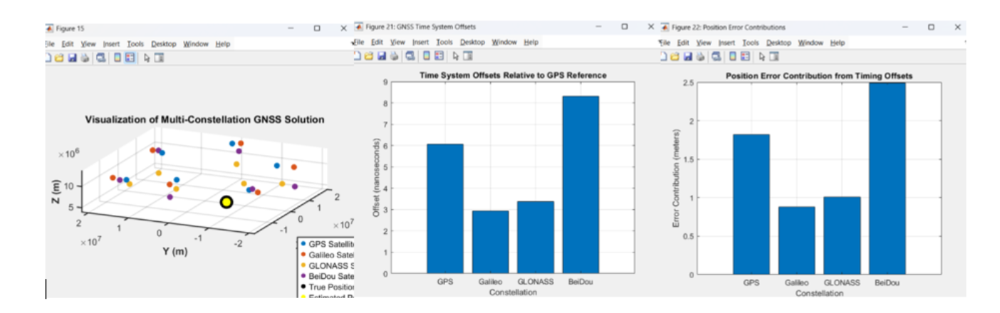
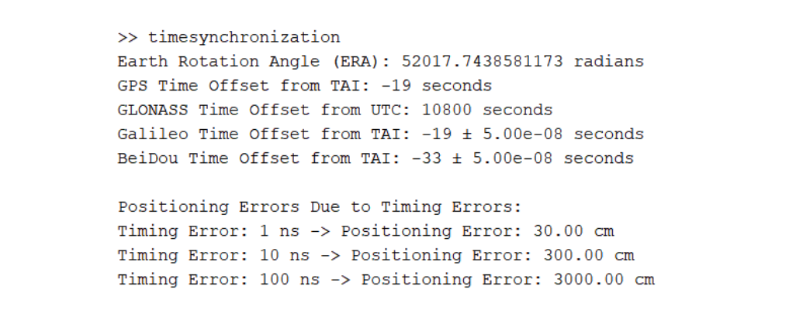

# GNSS Time Reference and Synchronization Analysis

## Overview
This project presents a system-level analysis of Global Navigation Satellite System (GNSS) time reference mechanisms and synchronization accuracy. The work focuses on understanding how different GNSS constellations maintain precise timing and how timing errors directly impact positioning accuracy.

The study was completed as part of a graduate-level coursework project and emphasizes clock drift, inter-system offsets, and their practical implications in navigation and communication systems. MATLAB was used to model timing behavior and visualize synchronization performance across constellations.

---

## GNSS Time References
Different GNSS constellations such as GPS, Galileo, GLONASS, and BeiDou operate using independent system time scales that are referenced to international standards such as UTC and TAI. Although these systems aim for nanosecond-level precision, small timing offsets and drift can significantly affect receiver position estimation.

The figures below illustrate GNSS timing offsets and their impact on positioning performance.

*GNSS system time offsets relative to UTC across multiple constellations.*

*Positioning error resulting from timing drift and synchronization offsets.*

---

## Key Analysis
- Studied GNSS system time references and their relationship to UTC and TAI  
- Analyzed clock drift and inter-constellation synchronization offsets  
- Evaluated the impact of timing errors on positioning accuracy  
- Compared timing performance across GPS, Galileo, GLONASS, and BeiDou  
- Modeled positioning error sensitivity to nanosecond-level timing deviations using MATLAB  

---

## Tools and Methodology
- MATLAB for timing analysis, visualization, and error modeling  
- GNSS timing equations and reference data for constellation comparison  

---

## Results

The analysis demonstrates how nanosecond-level timing errors in GNSS directly translate into measurable positioning inaccuracies and system-level performance degradation.

Key results from the study include:

- GPS showed the highest synchronization accuracy, achieving approximately ~20 ns alignment with UTC, while Galileo, GLONASS, and BeiDou exhibited comparatively larger offsets.
- Inter-system time differences between constellations were observed in the range of tens of nanoseconds, which can introduce positioning errors on the order of several meters if not corrected.
- Simulation results confirmed that even a 1 ns timing error can lead to approximately 30 cm of position error, highlighting the extreme sensitivity of GNSS navigation to clock drift.
- MATLAB-based modeling demonstrated the impact of clock bias, drift, and synchronization offsets on receiver position estimation.
- Multi-GNSS operation was shown to improve robustness and reduce convergence time, offering better overall timing stability compared to single-constellation systems.
- The study also highlighted practical challenges such as leap-second handling, inter-system offsets, and atmospheric delay contributions to timing uncertainty.

Overall, the results emphasize that precise time synchronization is fundamental not only for navigation accuracy, but also for critical infrastructure applications such as telecommunications, power grids, and financial systems.

---

## Learning Outcomes
This project strengthened understanding of:

- GNSS time reference systems and synchronization mechanisms  
- Relationship between timing accuracy and positioning error  
- System-level behavior of satellite navigation architectures  
- Practical challenges in high-precision timing systems  
- MATLAB-based modeling of real-world GNSS timing effects  

---

## Files
- `GNSS_Time_Synchronization_Report.pdf` – Full technical report  
- `gnss_time_offsets.png` – GNSS time offset comparison  
- `gnss_position_error.png` – Positioning error due to timing drift  

---

## Notes
This work was conducted for academic and learning purposes as part of a Master’s program in Electrical and Computer Engineering. The results are intended to demonstrate system-level timing analysis methodology rather than operational GNSS receiver implementation.
