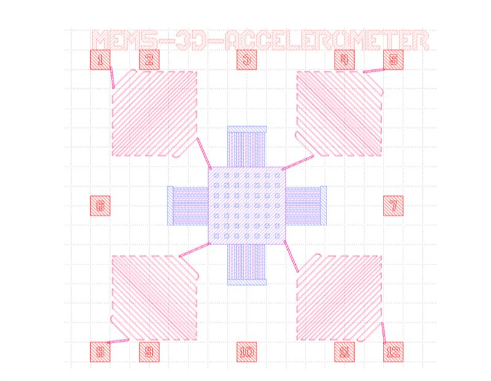
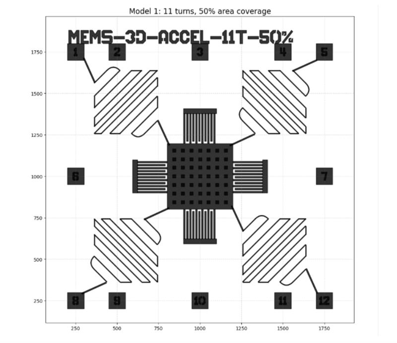

# Design and Visualization of a MEMS 3D Capacitive Accelerometer (PHIDL)

## Overview
This project presents the layout design and visualization of a MEMS-based three-axis capacitive accelerometer developed using PHIDL (Python-based layout generation). The design was inspired by literature (notably Petsch et al.) and focuses on manufacturable structural layout development, including test structures and routing variations.

The implementation intentionally emphasizes mechanical/structural modeling and GDS-oriented layout generation. Electrode placement was deliberately omitted at this stage to keep the work focused on structural design and visualization.

---

## Device Concept (3-Axis Capacitive Sensing)
A 3-axis MEMS capacitive accelerometer detects motion through capacitance changes caused by proof-mass displacement:
- **X/Y sensing:** interdigitated comb fingers; lateral motion changes overlap area and capacitance
- **Z sensing:** parallel-plate capacitor concept; vertical motion changes the gap and capacitance

---

## Layout Summary (Key Structural Elements)
The design was created over a **2000 µm × 2000 µm** die and includes:
- **Proof mass:** 395 µm × 395 µm, perforated with a **7×7 array (49) damping holes**
- **Springs:** four serpentine springs (4 turns) suspending the proof mass
- **Comb fingers:** interdigitated capacitor fingers for lateral-axis sensing structures
- **Bond pads:** distributed for external interfacing and routing studies
- **Test structures:** spring patterns, comb arrays, alignment/CD features to support manufacturability evaluation

*GDS layout overview of the accelerometer structure (PHIDL-generated).*

---

## Design Variations (Spiral Routing Study)
To evaluate routing density, DRC feasibility, and layout scalability, multiple spiral routing variants were designed across corner regions (turn-count and coverage variations). The study helps compare manufacturability trade-offs between lower-density and high-density routing options.

*Spiral routing variations used to study routing density and manufacturability constraints.*

---

## Tools and Methodology
- **PHIDL (Python):** parametric layout scripting and GDS generation
- **Design focus:** structural layout, routing feasibility, and test structure integration
- **Approach:** literature-guided dimensioning, variation study, and manufacturability-aware layout choices

---

## Results and Takeaways
- Successfully generated a complete, symmetric accelerometer structural layout with proof mass, springs, comb fingers, damping holes, and bond pads.
- Demonstrated routing density trade-offs via spiral turn-count and coverage studies.
- Integrated test structures to support future fabrication inspection and characterization workflows.
- Produced a manufacturability-oriented layout framework that can be extended later with electrode definition and electrical co-simulation.

---

## Files
- `MEMS_3D_Accelerometer_PHIDL_Report.pdf` – Full technical report
- `accelerometer_gds_overview.png` – Main layout overview image
- `spiral_variations.png` – Spiral routing variation image

---

## Notes
This work was completed for academic purposes as part of graduate-level MEMS design exploration. The layout emphasizes structural modeling and visualization; electrode placement and full electro-mechanical readout integration are planned future extensions.
