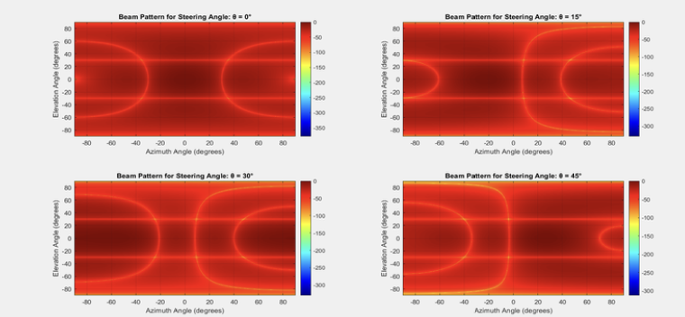

# MEMS-Based Optical Beam Steering for LiDAR Systems

## Overview
This project explores the application of Micro-Electro-Mechanical Systems (MEMS) for optical beam steering in LiDAR systems. The work focuses on modeling MEMS-based optical phased arrays to achieve precise beam steering with reduced power consumption and improved system compactness.

The project was completed as part of graduate-level coursework and research, using MATLAB and Lumerical FDTD simulations to analyze beam steering behavior, phase control, and far-field optical performance. The study highlights how MEMS integration can enhance LiDAR capabilities for applications such as autonomous navigation and intelligent sensing.

---

## MEMS Beam Steering Concept
Traditional LiDAR systems rely on mechanical scanning, which limits speed and durability. MEMS-based optical phased arrays enable electronic beam steering by controlling phase shifts across micro-mirror arrays, allowing rapid, precise, and compact beam modulation.

---

## Optical Performance Analysis
Electromechanical and optical simulations were performed to evaluate beam steering angle, side-lobe suppression, and far-field intensity distribution. MATLAB and Lumerical FDTD were used to study phase-controlled beam steering across MEMS mirror arrays.

*Simulated far-field beam steering pattern showing controlled main lobe direction and side-lobe levels.*

---

## Key Analysis
- Modeled MEMS optical phased arrays for LiDAR beam steering  
- Simulated electrostatic actuation and phase shifting behavior  
- Evaluated far-field radiation patterns and steering angles  
- Analyzed side-lobe suppression and beam efficiency  
- Compared MEMS-based steering with traditional mechanical scanning approaches  

---

## Tools and Methodology
- MATLAB for beam steering modeling and visualization  
- Lumerical FDTD for optical field simulations  
- Analytical beam steering equations for validation  

---

## Results

Simulation results demonstrate that MEMS-based optical phased arrays can achieve effective beam steering with high precision and reduced mechanical complexity.

Key outcomes include:

- Successful beam steering across multiple angles using phase-controlled MEMS arrays  
- Side-lobe levels maintained near −13 dB, indicating good optical isolation  
- Improved beam efficiency exceeding 90% in simulated configurations  
- Larger array sizes showed increased directivity and reduced beam divergence  
- MEMS-based steering provided faster response and lower power consumption compared to traditional rotating LiDAR systems  

The results highlight MEMS technology as a promising approach for compact, high-speed LiDAR systems suitable for autonomous vehicles and advanced sensing platforms.

---

## Learning Outcomes
This project strengthened understanding of:

- MEMS-based optical beam steering principles  
- Optical phased array operation  
- Electromechanical actuation in MEMS devices  
- Far-field optical analysis using FDTD  
- System-level considerations for LiDAR integration  

---

## Files
- `MEMS_LiDAR_Report.pdf` – Full technical report  
- `beam_steering_results.png` – Far-field beam steering results  

---

## Notes
This work was conducted for academic purposes as part of a Master’s program in Electrical and Computer Engineering. The simulations demonstrate modeling methodology and system behavior rather than optimized commercial LiDAR implementations.
