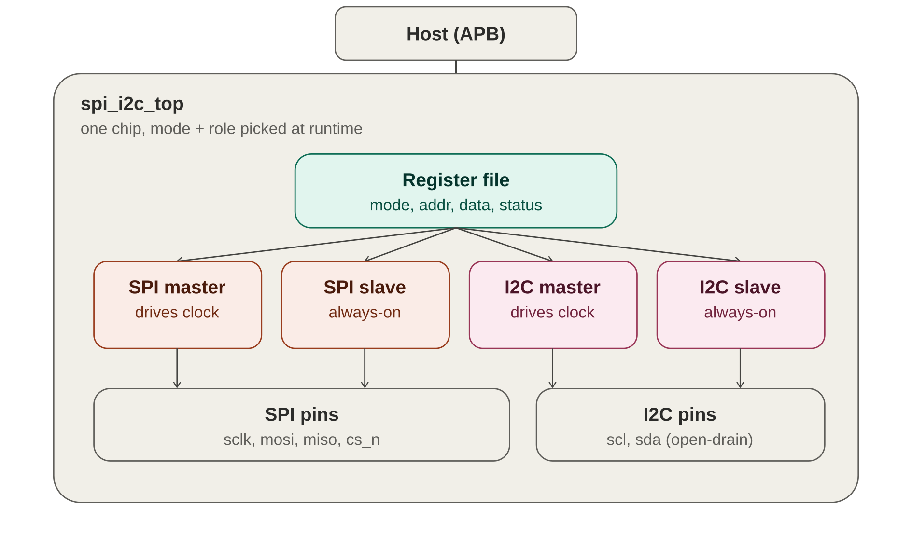
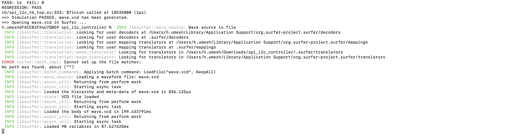
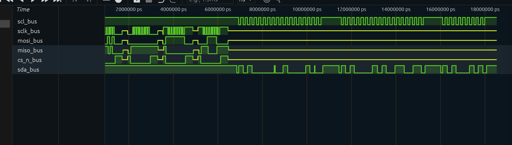
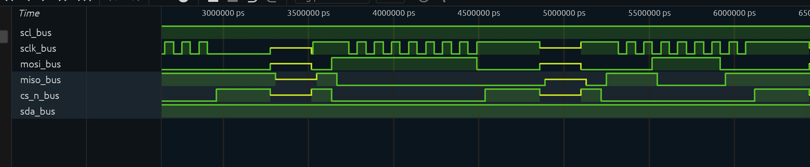
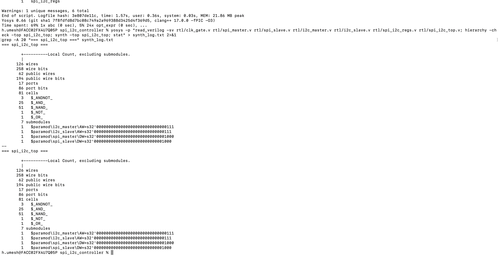

# SPI / I2C Peripheral Controller

<p align="left">
  
  
  
  
  
  <br>
  
</p>

A dual-protocol, dual-role peripheral controller — synthesizable in Verilog, verified with a SystemVerilog testbench, and carried through a synthesis flow with Yosys. Supports SPI and I2C, and can act as either **master or slave on either protocol**, selected at runtime through a register interface.

This repo is also a record of a real verification process: the testbench found **five genuine RTL bugs**, each tracked down through simulation-log analysis, targeted debug instrumentation, and one waveform capture — documented in full below, not just "it works."



## Contents

- [Highlights](#highlights)
- [Repository structure](#repository-structure)
- [Getting started](#getting-started)
- [Results](#results)
- [Bugs found and fixed](#bugs-found-and-fixed)
- [Tools used](#tools-used)
- [Documentation](#documentation)
- [License](#license)

## Highlights

- Full SPI engine (master + slave) supporting all 4 CPOL/CPHA modes
- Full I2C engine (master + slave): START/STOP, 7-bit addressing, ACK/NACK, clock stretching, simplified arbitration-loss detection
- Runtime-configurable mode/role via an APB-lite register file
- Clock gating as a low-power technique — applied only where it's actually safe to (see [bug 3](#bugs-found-and-fixed))
- SystemVerilog testbench: two instances of the design on shared buses, verifying real master↔slave interoperability
- 14/14 regression checks passing; ~1,073-cell generic synthesis result
- **5 real bugs found and fixed during verification**, each documented with symptom → root cause → fix
- Continuous integration: every push is automatically compiled, simulated, and lint-checked (see the badge above)

## Repository structure

<details>
<summary>Click to expand the full file tree</summary>

```
rtl/       clk_gate.v, spi_master.v, spi_slave.v, i2c_master.v,
           i2c_slave.v, spi_i2c_regs.v, spi_i2c_top.v
tb/        spi_i2c_pkg.sv, spi_i2c_assertions.sv, spi_i2c_tb_top.sv
syn/       yosys_synth.tcl, constraints.sdc, run_sta.tcl
scripts/   regression.py, run_waves.sh
docs/      DESIGN_NOTES.md, GETTING_STARTED.md, PROJECT_REPORT.pdf,
           INTERVIEW_PREP_GUIDE.pdf, images/
```
</details>

## Getting started

<details open>
<summary>macOS setup + run</summary>

```bash
# install tools
brew install icarus-verilog yosys surfer

# compile + simulate
iverilog -g2012 -o build/sim.out rtl/*.v tb/spi_i2c_pkg.sv tb/spi_i2c_tb_top.sv
vvp build/sim.out

# or run the full automated regression (compile + sim + lint)
python3 scripts/regression.py --lint

# generate + view a waveform
bash scripts/run_waves.sh
```
</details>

<details>
<summary>Never touched a hardware simulator before? Start here instead</summary>

See [`docs/GETTING_STARTED.md`](docs/GETTING_STARTED.md) — a complete, zero-assumptions walkthrough: installing tools, compiling, running, viewing waveforms, and running synthesis, one command at a time.
</details>

## Results

```
PASS: 14   FAIL: 0
REGRESSION: PASS
```



<details>
<summary>Waveform verification (click to expand)</summary>

Full simulation overview — four SPI transactions followed by two I2C transactions, captured on the shared bus wires:



Zoomed into a single SPI transfer — `cs_n_bus` low, `sclk_bus` toggling 8 times, `mosi_bus`/`miso_bus` shifting a full-duplex byte:


</details>

<details>
<summary>Synthesis results (click to expand)</summary>

Generic (technology-independent) synthesis via Yosys — no PDK/liberty file needed for this result:



| Module | Cells |
|---|---|
| spi_i2c_top (glue) | 81 |
| spi_i2c_regs | 181 |
| spi_master | 231 |
| spi_slave | 106 |
| i2c_master | 295 |
| i2c_slave | 175 |
| clk_gate (×2) | 2 each |
| **Total** | **1,073** |
</details>

## Bugs found and fixed

The centerpiece of this project. Full write-up with evidence trails in [`docs/PROJECT_REPORT.pdf`](docs/PROJECT_REPORT.pdf) and interview-ready STAR-format versions in [`docs/INTERVIEW_PREP_GUIDE.pdf`](docs/INTERVIEW_PREP_GUIDE.pdf). Short version:

<details open>
<summary><strong>1. spi_master.v — swapped CPHA branch</strong></summary>

**Symptom:** master captured a shifted-by-one byte in 3/4 SPI modes.
**Root cause:** CPHA=0/CPHA=1 branches were swapped in the final-bit-capture logic.
**Fix:** swapped the branches back.
</details>

<details>
<summary><strong>2. spi_slave.v — missing first-edge shift guard</strong></summary>

**Symptom:** slave's output shifted by one bit, CPHA=1 modes only.
**Root cause:** the master had a guard preventing a shift on the very first clock edge of a byte; the slave was missing the equivalent guard.
**Fix:** added the matching guard to the slave.
</details>

<details>
<summary><strong>3. spi_i2c_top.v — stale synchronizer state under clock gating</strong></summary>

**Symptom:** I2C failures were intermittent and depended on prior test history.
**Root cause:** clock-gating a slave engine's clock freezes its input synchronizer mid-flight; on re-enable it resumes from a stale bus reading — a classic clock-domain-crossing hazard.
**Fix:** restricted clock gating to the master engines only; slaves run on the always-on clock.
</details>

<details>
<summary><strong>4. i2c_slave.v — SDA released mid-ACK-phase</strong></summary>

**Symptom:** a matching-address write was falsely NACKed.
**Root cause:** SDA was released while SCL was still high, indistinguishable from a STOP condition per the I2C spec.
**Fix:** gated the release on SCL's falling edge instead.
</details>

<details>
<summary><strong>5. i2c_slave.v — ACK released one phase too early</strong></summary>

**Symptom:** transaction completed correctly, but the master still reported an ACK error.
**Root cause:** the slave released the ACK line ~8 cycles before the master's own high-phase counter actually sampled it.
**Fix:** added a holding state that keeps the ACK line driven until the master genuinely moves on.
</details>

## Tools used

Icarus Verilog · Yosys · Surfer (waveform viewer) · Python 3 · GitHub Actions (CI) · OpenSTA (flow prepared, not run — no PDK available)

## Documentation

- [`docs/GETTING_STARTED.md`](docs/GETTING_STARTED.md) — step-by-step setup and usage guide
- [`docs/PROJECT_REPORT.pdf`](docs/PROJECT_REPORT.pdf) — full IEEE-style project report
- [`docs/INTERVIEW_PREP_GUIDE.pdf`](docs/INTERVIEW_PREP_GUIDE.pdf) — concepts glossary, bug write-ups in interview format, and full source code appendix

## License

MIT — see [LICENSE](LICENSE).
