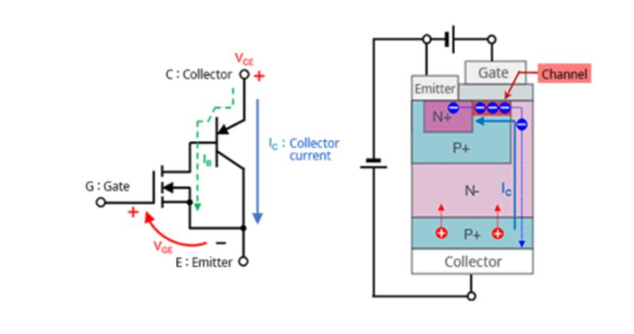
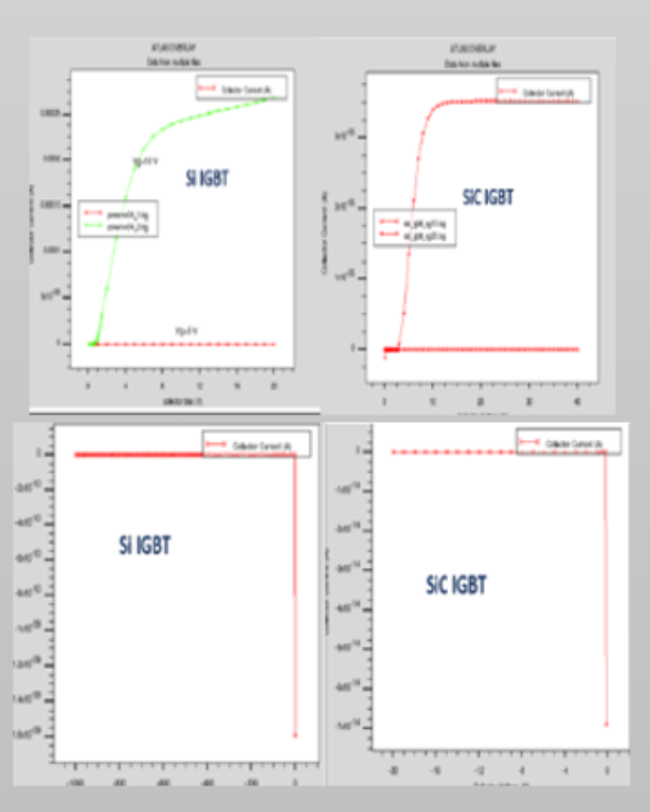

# Si vs SiC IGBT TCAD Simulation

## Overview
This project presents a comparative device-level simulation study of Silicon (Si) and Silicon Carbide (SiC) Insulated Gate Bipolar Transistors (IGBTs) carried out as part of a graduate-level coursework and research activity. The primary objective of the work is to understand how material properties influence electrical performance, thermal behavior, and switching characteristics in high-power semiconductor devices.

The study combines TCAD-based device modeling with MATLAB-based post-processing to analyze current–voltage behavior, breakdown characteristics, and temperature-related effects in both Si and SiC IGBTs.

---

## Device Structure and Modeling
The IGBT structures were modeled using a vertical device architecture consisting of emitter, base, drift, and collector regions. While the overall structure of Si and SiC IGBTs is similar, the material properties such as bandgap, critical electric field, and thermal conductivity differ significantly and strongly impact device behavior.

The figure below illustrates the modeled IGBT device structure used for simulation and analysis.

---

## Electrical Performance Comparison
Forward I–V characteristics were extracted for both Silicon and Silicon Carbide IGBTs under identical biasing conditions. The results highlight the improved electrical performance of SiC devices, particularly under high-voltage operation. SiC IGBTs exhibit lower conduction losses and improved breakdown capability due to their higher critical electric field.

The comparison plot below shows the difference in electrical response between Si and SiC devices.

---

## Key Observations
- Silicon Carbide IGBTs demonstrate higher breakdown voltage compared to Silicon IGBTs for similar device dimensions  
- Reduced tail current effects were observed in SiC devices, indicating improved switching performance  
- SiC devices show better thermal stability, making them suitable for high-temperature and high-power applications  

---

## Tools and Methodology
- Silvaco ATLAS TCAD was used for device structure definition and electrical simulation  
- MATLAB was used for data extraction, comparison, and visualization of results  

---

## Learning Outcomes
This project helped develop a deeper understanding of:
- Semiconductor device physics and material-dependent behavior  
- Power device operation under high electric field conditions  
- Practical challenges in TCAD simulation such as convergence and runtime limitations  
- Trade-offs between Silicon and wide-bandgap semiconductor technologies in power electronics  

---

## Notes
This work was conducted for academic and learning purposes as part of a Master’s program in Electrical and Computer Engineering. The results are intended to demonstrate modeling methodology and comparative analysis rather than optimized commercial device design.
