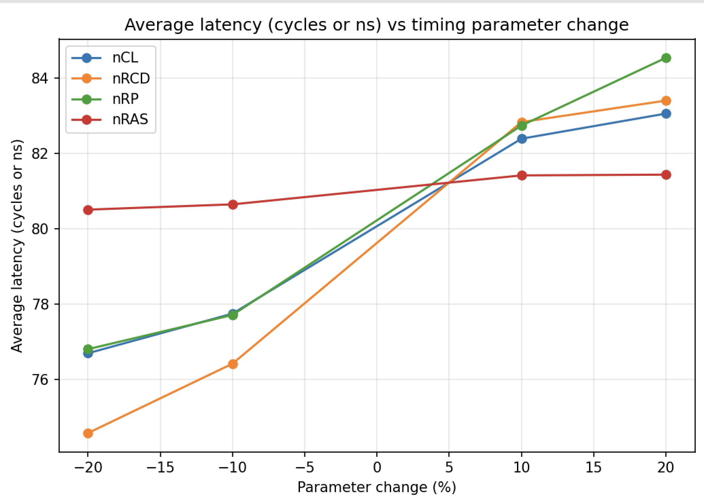
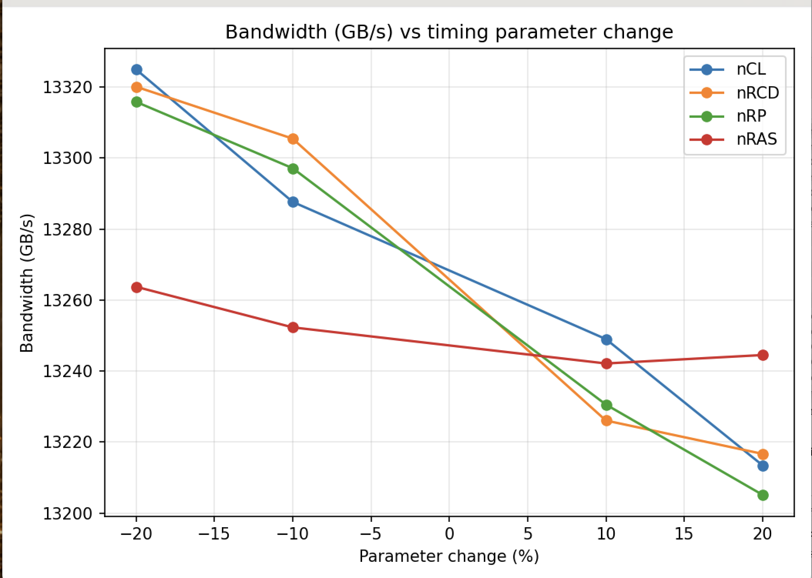
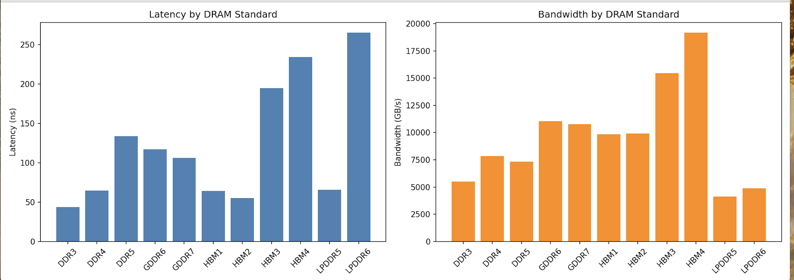

# DRAM Timing Sensitivity Study

*How much does a DRAM timing parameter actually matter? Turns out — it depends.*

A hands-on memory-systems project built with **[Ramulator2](https://github.com/CMU-SAFARI/ramulator2)** (cycle-accurate DRAM simulator) and **[CACTI](https://github.com/HewlettPackard/cacti)** (array-level power/energy estimator), exploring how JEDEC timing parameters shape DRAM latency and bandwidth — and how 11 different memory standards trade off speed, throughput, and (implicitly) power.

---

## TL;DR

I swept four core DDR4 timing parameters (`nCL`, `nRCD`, `nRP`, `nRAS`) by ±10–20% and measured the effect on latency and bandwidth using a real cycle-accurate simulator. Then I extended the study across **11 DRAM standards** — from DDR3 to HBM4 — to see how the whole memory landscape trades off latency vs. bandwidth.

**The one-line finding:** three of the four timing parameters gate the critical path and matter a lot — the fourth (`nRAS`) barely moved the needle, because it's a *floor*, not a *bottleneck*, under this workload. Not all timing parameters are created equal — it depends on whether your workload actually presses against that specific constraint.

---

##  Tools Used

| Tool | Role |
|---|---|
| [Ramulator2](https://github.com/CMU-SAFARI/ramulator2) | Cycle-accurate DRAM simulator (used via its native Python API) |
| [CACTI](https://github.com/HewlettPackard/cacti) | DRAM-level energy-per-access estimation |
| Python 3.14 / matplotlib | Sweep orchestration + plotting |

> Built entirely from source on macOS (Apple Silicon, g++-16). No pre-built binaries, no shortcuts.

---

##  Experiment 1: Timing Parameter Sweep (DDR4-2400)

Swept `nCL`, `nRCD`, `nRP`, `nRAS` independently at ±10% / ±20%, holding everything else at DDR4_2400R defaults. Workload: synthetic 80% read / 20% write trace via Ramulator2's built-in `LatencyThroughputTrace` generator.

<p align="center">
  
  
</p>

**Result table:**

| Parameter | Baseline | Latency swing (±20%) | Bandwidth swing (±20%) | Sensitivity |
|---|---|---|---|---|
| nCL  | 16 | 76.7 → 83.1 ns | 13325 → 13213 GB/s | High |
| nRCD | 16 | 74.6 → 83.4 ns | 13320 → 13217 GB/s | **Highest** |
| nRP  | 16 | 76.8 → 84.5 ns | 13316 → 13205 GB/s | High |
| nRAS | 39 | 80.5 → 81.4 ns | 13264 → 13245 GB/s | **Low** ⚠️ |

**Why nRAS is the interesting outlier:** `nRAS` is a *minimum* row-open-time constraint, not a direct component of access latency. It only bites if a row would otherwise close before `nRAS` elapses — under this workload, rows already stayed open longer than that floor for other reasons, so ±20% on `nRAS` barely moved anything. `nCL`, `nRCD`, and `nRP`, on the other hand, sit squarely on the ACT → RD/WR → PRE critical path, so they show up almost linearly in the results.

Full raw data: [`results/sweep_results.csv`](results/sweep_results.csv)

---

## Experiment 2: Cross-Standard Comparison

Same methodology, but instead of sweeping DDR4's timings, this compares **11 different DRAM standards** at their own default JEDEC timings — DDR3 through DDR5, LPDDR5/6, GDDR6/7, and HBM1 through HBM4 — using Ramulator2's own test-harness config for each.

<p align="center">
  
</p>

| Standard | Latency (ns) | Bandwidth (GB/s) |
|---|---|---|
| DDR3   | 43.7  | 5,497 |
| DDR4   | 64.6  | 7,838 |
| DDR5   | 133.8 | 7,311 |
| LPDDR5 | 65.8  | 4,112 |
| LPDDR6 | 264.9 | 4,884 |
| GDDR6  | 116.8 | 11,060 |
| GDDR7  | 106.0 | 10,787 |
| HBM1   | 64.2  | 9,827 |
| HBM2   | 55.3  | 9,896 |
| HBM3   | 194.5 | 15,449 |
| HBM4   | 234.2 | 19,166 |

**What this shows:** no single DRAM standard "wins" — each occupies a different point in the latency/bandwidth/power design space, chosen for its target market:

-  **HBM3/4** — huge bandwidth, but the highest latency of the set — built for GPU/AI accelerator throughput, not per-access speed.
-  **GDDR6/7** — the graphics-card sweet spot: strong bandwidth, moderate latency.
-  **DDR3/4** — the lowest latency here — general-purpose CPU memory, tuned for responsiveness.
-  **LPDDR5/6** — the *lowest* bandwidth of the whole set... but this benchmark doesn't measure power, which is the actual dimension LPDDR is optimized for. A benchmark "loss" here isn't a real loss — it's the wrong metric for the job.

Full raw data: [`results/standards_comparison.csv`](results/standards_comparison.csv)

---

##  How It Was Built

1. **Built Ramulator2 from source** — hit one real Apple Clang compile error (needed an explicit `template` keyword for a dependent template name in `param.h`), patched it, rebuilt clean.
2. **Discovered Ramulator2's actual API** by reading its own test suite (`tests/latency_throughput/utils/runner.py`) rather than guessing — this build compiles as a native Python extension module, not a CLI/YAML tool.
3. **Built CACTI from source** — fixed its Makefile to use the actual installed compiler (`g++-16`, not the assumed `g++-13`).
4. **Wrote a sweep harness** ([`scripts/run_sweep.py`](scripts/run_sweep.py)) that constructs a fresh DDR4 DRAM object per parameter override, runs it through a `GenericDDR` controller with FR-FCFS-RowHit scheduling, and pulls latency/bandwidth out of the returned stats dict.
5. **Estimated energy** ([`scripts/append_energy.py`](scripts/append_energy.py)) via CACTI's DRAM-level output.
6. **Extended to 11 standards** ([`scripts/compare_standards.py`](scripts/compare_standards.py)) by reusing Ramulator2's own `run_single_config_point()` test-harness function directly.
7. **Plotted everything** ([`scripts/plot_results.py`](scripts/plot_results.py)).

---

##  Repo Structure

```
.
├── scripts/
│   ├── run_sweep.py            # Sweeps nCL/nRCD/nRP/nRAS on DDR4
│   ├── append_energy.py        # Appends CACTI energy estimate to results
│   ├── compare_standards.py    # Runs all 11 DRAM standards
│   └── plot_results.py         # Generates the comparison plots
├── results/
│   ├── sweep_results.csv
│   ├── standards_comparison.csv
│   ├── latency_vs_param.png
│   ├── bandwidth_vs_param.png
│   └── standards_comparison.png
└── README.md
```

---

## ⚠️ Known Limitations

- Synthetic trace, not a real application trace (SPEC CPU, etc.) — real workloads have richer locality patterns.
- CACTI's energy number is a constant DRAM-level ballpark — its memory-config search doesn't accept custom JEDEC timing overrides. [DRAMPower](https://github.com/tukl-msd/DRAMPower) would give real per-configuration energy.
- Single-channel, single-rank configuration — sweeping channel/rank count and address-interleaving is a natural next step.
- No refresh overhead modeled.

---

##  Possible Next Steps

- Swap in DRAMPower for real per-configuration energy modeling
- Model refresh (`nRFC`) interaction with these same timings
- Sweep row policy (open-page vs. closed-page) — should dramatically amplify `nRP`/`nRCD` sensitivity
- Use a real memory trace (SPEC CPU2017) instead of synthetic traffic

---

## Acknowledgments

Built on top of [Ramulator2](https://github.com/CMU-SAFARI/ramulator2) (CMU SAFARI Research Group) and [CACTI](https://github.com/HewlettPackard/cacti) (HP Labs). All simulation and analysis code in this repo is original.
