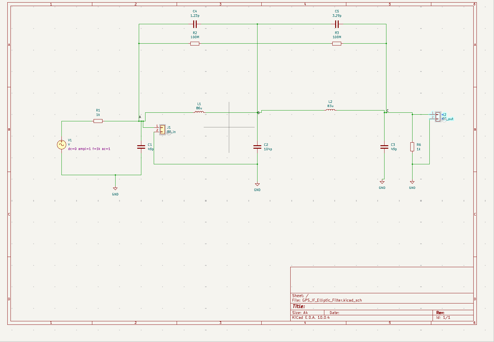
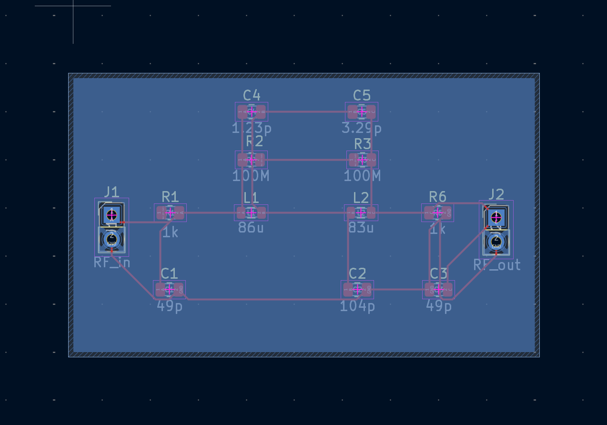
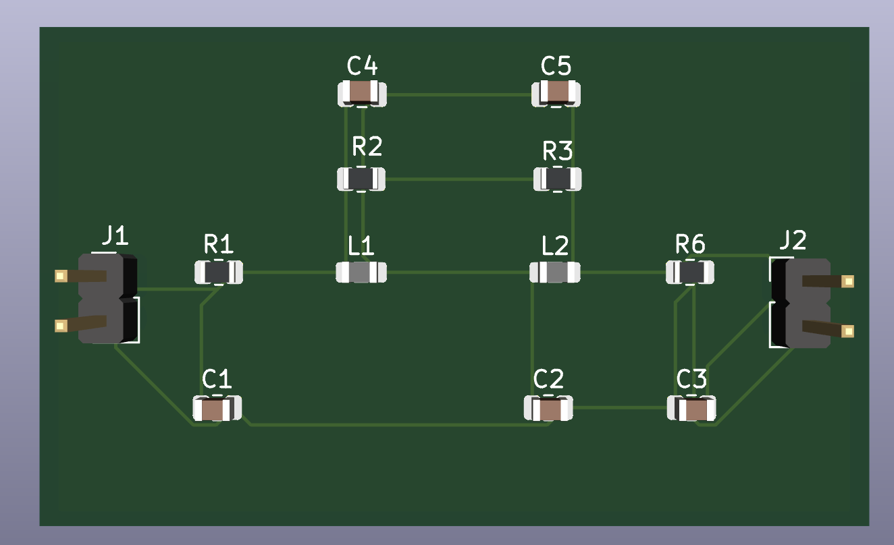
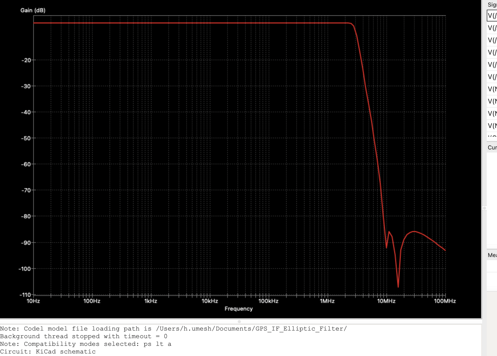

# GPS IF elliptic low-pass filter — PCB design

Somewhere between "5th-order Elliptic Cauer filter" on a datasheet and a board you
could actually hand someone, there's a design process — schematic capture, footprint
selection, placement, routing, a ground plane, and a simulation to prove it does
what it says. This project walks that full path for a GPS receiver IF filter, start
to finish, in KiCad.

The short version: a passive LC ladder filter that passes everything below ~3 MHz
and kills everything above ~10 MHz by at least 80 dB, laid out on a real board with
RF-conscious placement and routing.

## Specifications

| Parameter | Target |
|---|---|
| Topology | 5th-order Elliptic (Cauer) LC low-pass |
| Bandwidth | ≈ 3.0 MHz |
| Minimum stopband attenuation | ≥ 80 dB near 10 MHz |
| Source / load impedance | 1 kΩ |

## The circuit

A passive ladder: two inductors (88 µH, 83 µH), three shunt capacitors (49 pF,
104 pF, 49 pF), and two bridging capacitor/resistor pairs (1.23 pF + 100 MΩ,
3.29 pF + 100 MΩ). Those bridging pairs are what make it *elliptic* rather than a
plain Butterworth — they carve two sharp notches (transmission zeros) into the
stopband, buying steep rolloff without extra filter order.



## PCB layout

Components follow the signal path left to right — RF_IN → R1 → L1 → L2 → R6 →
RF_OUT — so nothing routes backward across the board. Each bridging pair sits
directly above its associated inductor, keeping the zero-forming path as short as
the ladder diagram implies it should be. A ground plane (copper pour) on the back
copper layer ties every ground reference together and gives the whole circuit a
low-impedance return path, rather than daisy-chaining ground traces and hoping.





Routing and ground plane were verified with KiCad's Design Rules Checker — 0
violations, 0 unconnected items.

## Simulation

AC small-signal analysis was run in KiCad's built-in ngspice simulator (10 Hz –
100 MHz sweep) to verify the frequency response before finalizing the layout.



The simulated response shows a flat passband to ~3 MHz, a sharp rolloff, and two
deep notches (the elliptic transmission zeros) near 10 MHz reaching below -100 dB —
consistent with the original design targets.

## Files to add from KiCad

This repo ships with the README and rendered images. Drop these in alongside them,
copied straight from your KiCad project folder on disk (no export needed — they're
just the project's native files):

- `GPS_IF_Elliptic_Filter.kicad_pro` — project file
- `GPS_IF_Elliptic_Filter.kicad_sch` — schematic
- `GPS_IF_Elliptic_Filter.kicad_pcb` — PCB layout

The four images already in `images/` were captured like this, if you want to
regenerate or update them:

- **schematic.png** — Schematic Editor, press `F` to fit the sheet, then screenshot
  (or **File → Plot** for a clean export)
- **pcb_layout_2d.png** — PCB Editor, top-down view with F.Cu + silkscreen visible,
  press `F` to fit, screenshot
- **pcb_3d_render.png** — PCB Editor → **View → 3D Viewer**, orient the board, then
  **File → Export Current View as PNG** in the 3D Viewer window
- **bode_plot_ac_sim.png** — Schematic Editor → simulator tab, with the AC analysis
  run and `V(/C) (gain)` plotted, screenshot the graph

Final folder should look like:

```
gps-if-elliptic-filter-pcb/
├── README.md
├── GPS_IF_Elliptic_Filter.kicad_pro
├── GPS_IF_Elliptic_Filter.kicad_sch
├── GPS_IF_Elliptic_Filter.kicad_pcb
└── images/
    ├── schematic.png
    ├── pcb_layout_2d.png
    ├── pcb_3d_render.png
    └── bode_plot_ac_sim.png
```

## Tools

Designed entirely in [KiCad](https://www.kicad.org/) (schematic capture, PCB
layout, ground plane / copper pour, DRC, and ngspice-based AC simulation).

## Notes

Built entirely as a software design exercise — the goal was the methodology
(schematic → simulation → layout → verification), not a fabricated board. `RF_IN`
and `RF_OUT` break out to simple 2-pin headers, so the board is ready to probe or
fab if that's ever the next step.
