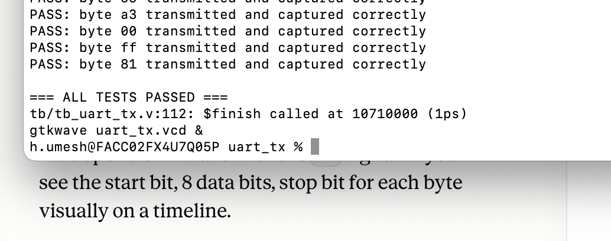
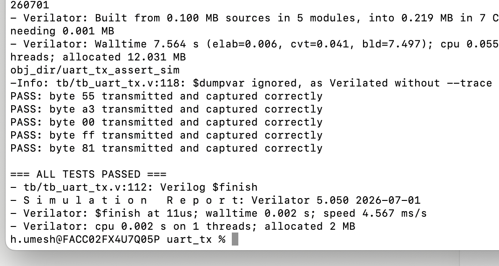
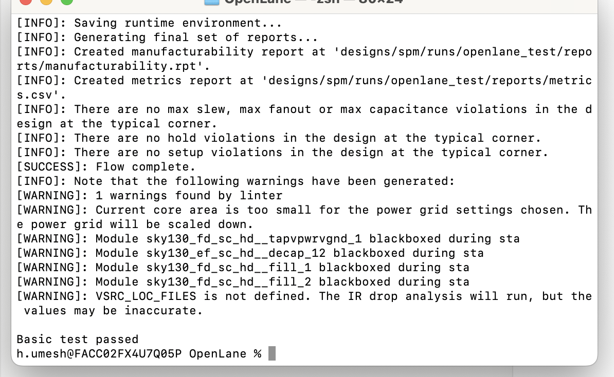
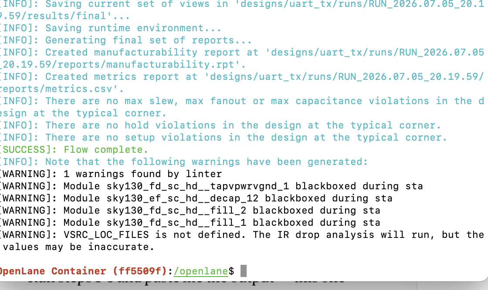
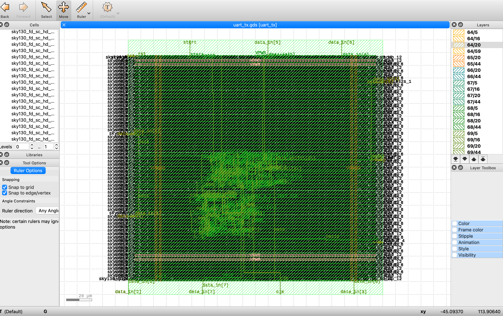
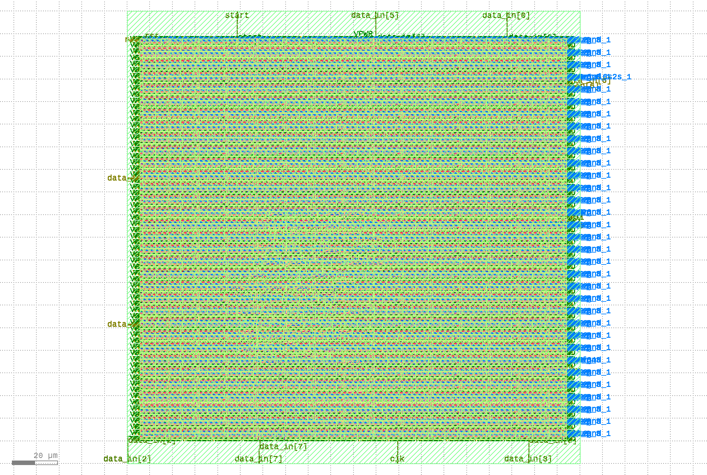
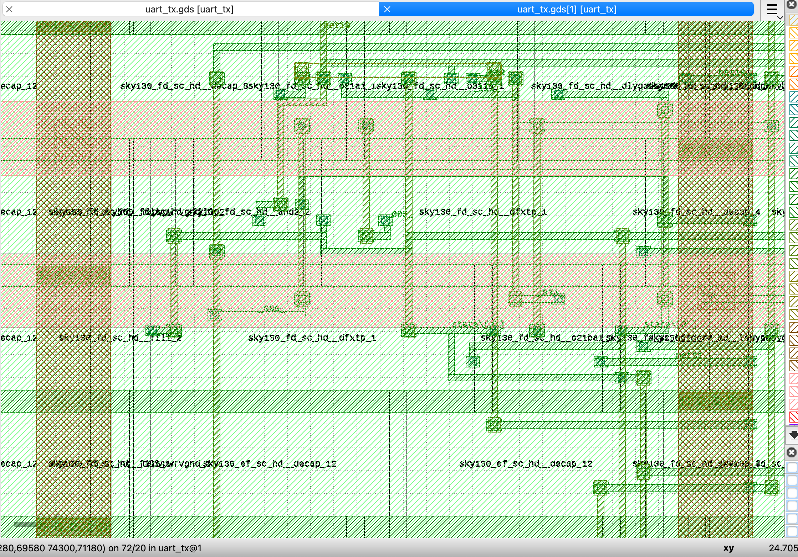
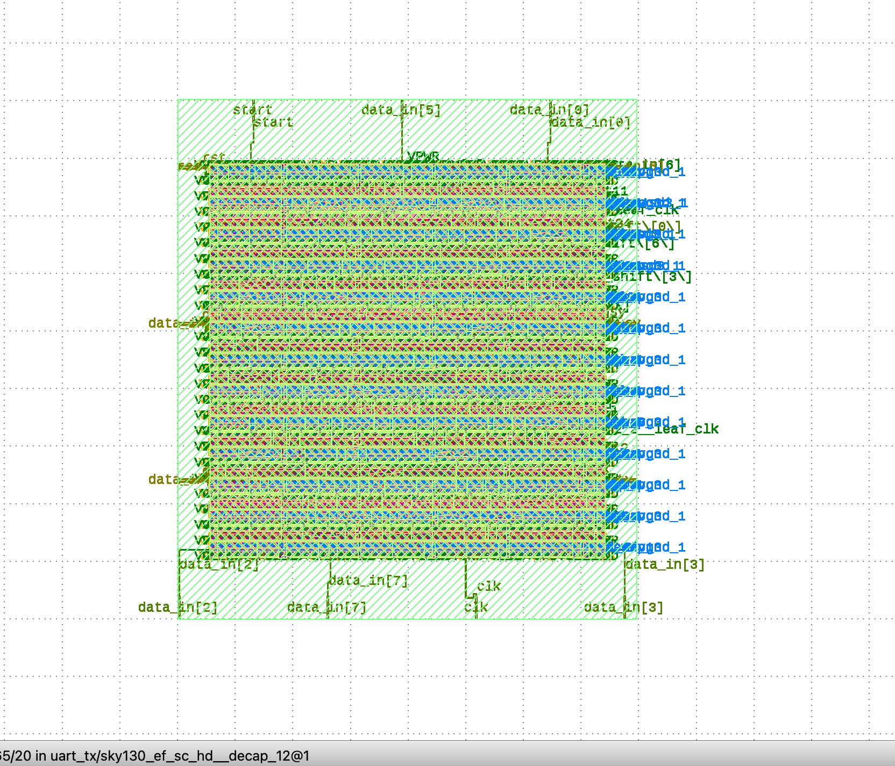

# uart_tx — An Open-Source RTL-to-GDSII Journey 🛠️⚡

> A tiny 8-bit UART transmitter, taken all the way from a blank Verilog
> file to a DRC-clean, LVS-clean, tapeout-ready chip layout — using
> **100% free and open-source tools**, on an M-series Mac, in a single
> day.

No proprietary EDA licenses. No university lab account. Just Verilog,
Icarus, Verilator, Yosys, OpenLane, and the open **SkyWater 130nm**
process.

---

## 🧭 What's actually in this repo

| Layer | What it proves |
|---|---|
| **RTL** (`rtl/uart_tx.v`) | A clean, parameterized, latch-free FSM design |
| **Functional simulation** (`tb/tb_uart_tx.v`) | Directed self-checking testbench — verifies real UART framing bit-by-bit |
| **Formal-style assertions** (`tb/uart_tx_assertions.sv`) | Concurrent SVA properties that continuously police protocol correctness, not just at chosen sample points — and one of them **caught a real one-cycle timing subtlety** in the design during development |
| **Physical design** (`openlane/`) | Two full, independent OpenLane runs against the open SKY130 PDK — one naive, one optimized — with hard metrics showing the difference |

This isn't a toy "it compiles" repo. It's a complete, verified,
physically-implementable chip, verified at multiple levels of rigor,
with the tradeoffs of floorplanning decisions actually measured.

---

## 🔩 The design

An 8-bit parallel-to-serial **UART transmitter**:

- Standard framing: 1 start bit (`0`) → 8 data bits (LSB-first) → 1 stop bit (`1`)
- Fully parameterized baud rate via `CLK_FREQ` / `BAUD_RATE`
- Simple, synthesis-friendly 4-state FSM (`IDLE → START → DATA → STOP`)
- Zero latches, zero combinational loops, zero surprises

```
data_in[7:0] ──┐
               ▼
   ┌────────────────────┐
   │   uart_tx FSM        │───► tx  (serial line)
   │  IDLE→START→DATA→STOP│
   └────────────────────┘
               ▲
     start ────┘        busy ◄── (status flag)
```

---

## ✅ Verification, in layers

### 1. Directed functional simulation — Icarus Verilog
```bash
make sim
```
Sends 5 test bytes (`0x55`, `0xA3`, `0x00`, `0xFF`, `0x81`), samples the
`tx` line at the FSM's own baud tick, and checks start bit / 8 data bits
/ stop bit against the expected pattern.

**Result:** `=== ALL TESTS PASSED ===`



### 2. Concurrent SVA assertions — Verilator
```bash
make assert
```
Five properties, checked on *every single clock edge* for the entire
simulation — not just at hand-picked sample points:

| # | Property | Catches |
|---|---|---|
| A1 | `tx` never goes unknown (X/Z) post-reset | Floating/uninitialized output bugs |
| A2 | `tx` stays high whenever idle | Idle-line violations |
| A3 | `busy` asserts within 1 cycle of `start` | Missed transmission starts |
| A4 | Start bit is genuinely `0` | Malformed frames |
| A5 | `busy` always deasserts within one frame's time | Hung/stuck transmitter |

Plus 2 `cover property` statements confirming the testbench actually
exercises both "start while idle" and "start while busy" scenarios.

> 🐛 **A4 actually caught a real bug during development.** The first
> version of this assertion assumed the start bit appears exactly 1
> cycle after `start` is asserted — but the FSM's state transition
> (`IDLE→START`) and the `tx<=0` action *within* the `START` state are
> two separate clocked events, so the real latency is 2 cycles. The
> assertion was fixed to match the (correct) hardware behavior. This is
> exactly the kind of subtle timing bug that a directed testbench can
> silently miss if it doesn't happen to sample at the wrong moment —
> and exactly what continuous assertions are for.



### 3. Synthesis sanity check — Yosys
Confirms the design maps cleanly to real standard cells with no
inferred latches and a sane gate count.

### 4. Full physical implementation — OpenLane + SKY130
Complete RTL→GDSII flow: synthesis → floorplan → placement → clock
tree synthesis → global/detailed routing → DRC → LVS → static timing
analysis.

**Both runs came back 100% clean:**
- 0 setup violations
- 0 hold violations
- 0 max slew / fanout / capacitance violations
- 0 DRC violations
- 0 LVS errors





---

## 📐 Two floorplans, one design — a real engineering comparison

Same 150-cell synthesized netlist, run twice with different floorplan
strategies, to actually *measure* what a bad floorplanning decision
costs:

| Metric | Naive (fixed 200×200 die) | Optimized (auto-sized, 35% util) | Change |
|---|---|---|---|
| Die area | 0.04 mm² | 0.0072 mm² | **~5.6× smaller** |
| Core utilization | 5.1% | 37.5% | Much tighter |
| Total filler cells | 3,539 | 625 | **5.7× fewer** |
| Worst timing slack | 0.0 ns | 0.0 ns | Both clean |
| Critical path | 1.47 ns | 1.43 ns | Nearly identical |

Full breakdown in [`docs/METRICS_COMPARISON.md`](docs/METRICS_COMPARISON.md).

**The point:** forcing a tiny design into an oversized die doesn't add
functionality — it just forces the tool to burn silicon area on filler
cells to satisfy DRC and power-grid rules. Same logic, same timing,
same correctness — 5.6× less area. In a real tapeout, that's a direct
cost difference.

---

## 🖼️ The layout

Opened in KLayout — real metal routing, real standard cells, real
power straps, DRC-clean:

**Full chip, naive floorplan** — I/O pins visible around the border
(`start`, `data_in[0-7]`, `clk`, `rst`, `VPWR`):


**Pin detail** — every port from the Verilog module (`clk`, `rst`,
`data_in[7:0]`, `start`, `tx`, `busy`) correctly placed and labeled:


**Zoomed cell-level detail** — individual standard cells, diffusion,
poly, and multi-layer routing:


**Optimized floorplan (`uart_tx_small`)** — same logic, ~5.6× smaller
die:


---

## 🚀 Running it yourself

Full step-by-step instructions, tool installation, and troubleshooting
notes are in [`RUNBOOK.md`](RUNBOOK.md).

Quick version:
```bash
# Functional sim
brew install icarus-verilog gtkwave
make sim

# Formal-style assertions
brew install verilator
make assert

# Synthesis check
brew install yosys
yosys -p "read_verilog rtl/uart_tx.v; synth -top uart_tx; stat"

# Full physical design (needs Docker)
git clone https://github.com/The-OpenROAD-Project/OpenLane.git
cd OpenLane && make && make test
# then drop rtl/ and openlane/uart_tx/config.json into designs/uart_tx/
# and run: ./flow.tcl -design uart_tx  (inside `make mount`)
```

---

## 🧰 Toolchain — 100% open source

| Purpose | Tool |
|---|---|
| RTL | Verilog / SystemVerilog |
| Functional simulation | [Icarus Verilog](http://iverilog.icarus.com/) |
| Waveform viewing | [GTKWave](https://gtkwave.sourceforge.net/) |
| Formal-style assertions | [Verilator](https://www.veripool.org/verilator/) |
| Synthesis | [Yosys](https://yosyshq.net/yosys/) |
| Place & route / STA | [OpenLane](https://github.com/The-OpenROAD-Project/OpenLane) ([OpenROAD](https://theopenroadproject.org/) under the hood) |
| PDK | [SkyWater SKY130](https://github.com/google/skywater-pdk) (open, via Google/SkyWater) |
| Layout viewer | [KLayout](https://www.klayout.de/) |

No vendor tools. No licenses. No university EDA lab required.

---

## 🌱 Where this could go next

- Add a matching **UART RX** module for a full duplex pair
- Wrap TX+RX+FIFO into a small memory-mapped peripheral
- Add parity / flow control (RTS/CTS)
- Submit to [**Tiny Tapeout**](https://tinytapeout.com) for an actual
  fabricated chip — this design is already small enough and clean
  enough to qualify

---

## 📄 License

MIT — do whatever you want with this, attribution appreciated.
